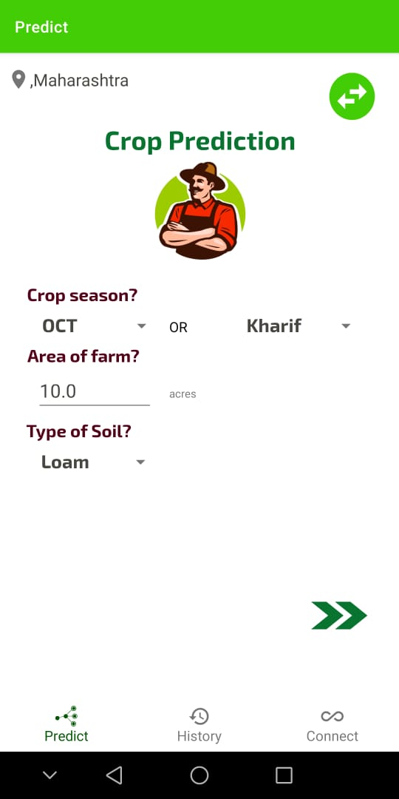
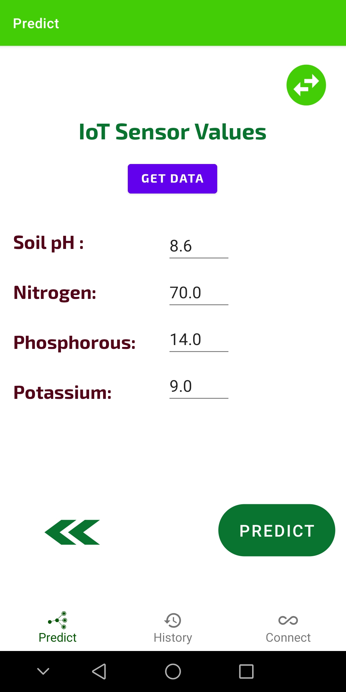
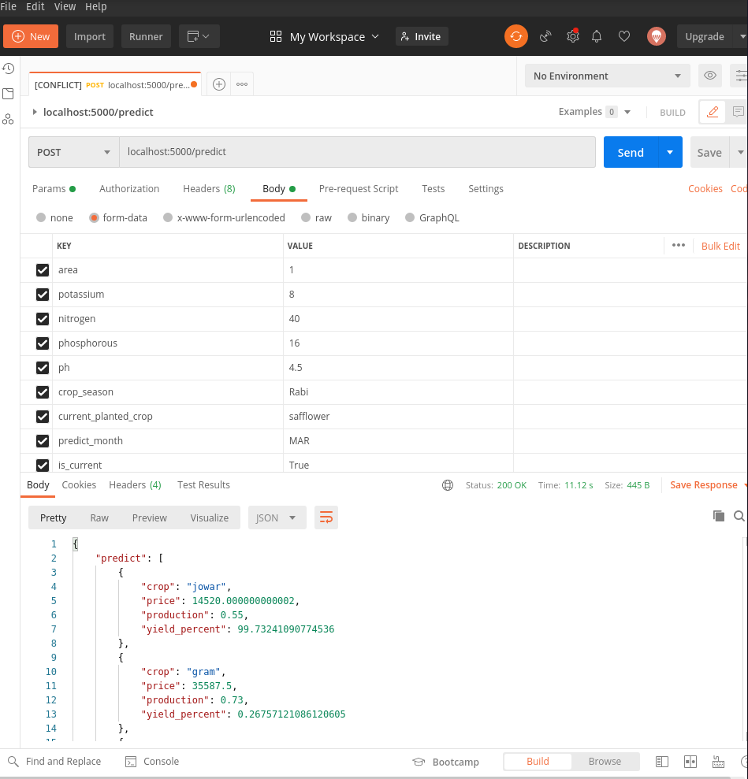

# Lets_HackIT  

This repo is maintained for the purpose of android studio learners. This is an android application integrated with IoT and ML. Inputs are given automatically using GPS and IoT . All user has to do is enter the time of year and bingo, Crop is predicted.

## Workflow of the entire solution  
  
                           
## The solution is divided into 5 major aspects  
  - [Front end](#front-end)
  - [Data analysis and generation](#data-analysis-and-generation)
  - [AI/ML](#aiml)
  - [App Deployment](#deployement-backend)
  - [Outputs](#output)

  
### Front End  
- User Friendly  
  -  SELECT THE MONTH/SEASON 
  -  TYPE OF SOIL
  -  AREA OF FARM 
  -  BILINGUAL SUPPORT IN ENGLISH AND HINDI.  
 - Location  
   - GPS TO GET LATITUDE AND LONGITUDE AUTOMATICALLY  
 - IOT Sensor  
   - N,P,K  
   - Soil pH  
 - Prediction  
   - crop + Prediction  
   - Yield  
   - PDF containing the information of predicted crop  
 - Connect  
   - Agricultural agencies  
   - Agricultural resources/links  
 - History  
   - List and information of previously grown crops   
   
          
 
   

## Output

### Postman Test
 

### App Output
 

